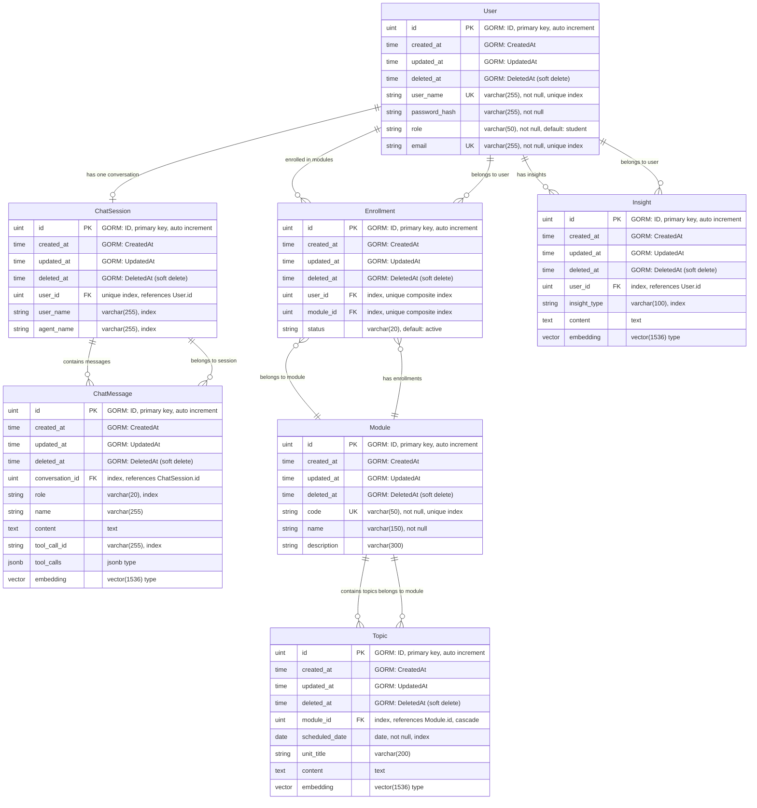

# Documentación de Base de Datos

## AIEP Education Agent System

### Resumen Ejecutivo

El sistema AIEP Education Agent utiliza una base de datos PostgreSQL con extensiones avanzadas para manejar datos vectoriales (pgvector) y JSON. El diseño está optimizado para un sistema de educación personalizada que combina gestión de usuarios, módulos académicos, conversaciones con IA y análisis de insights estudiantiles.

### Arquitectura de Datos

La base de datos implementa un patrón de diseño relacional con las siguientes características técnicas:

- **ORM**: GORM (Go Object-Relational Mapping)
- **Base de Datos**: PostgreSQL con extensiones
- **Soft Delete**: Implementado en todas las entidades principales
- **Búsqueda Vectorial**: Embeddings de 1536 dimensiones para IA
- **Índices Optimizados**: Para consultas frecuentes y relaciones

---

## Diagrama Entidad-Relación



---

## Descripción de Entidades

### 🧑‍🎓 User (Usuarios)

**Propósito**: Entidad central que representa estudiantes, profesores y administradores del sistema.

| Campo           | Tipo         | Descripción                          | Restricciones                |
| --------------- | ------------ | ------------------------------------ | ---------------------------- |
| `id`            | uint         | Identificador único auto-incremental | PK, Not Null                 |
| `user_name`     | varchar(255) | Nombre de usuario para login         | Unique, Not Null, Indexed    |
| `password_hash` | varchar(255) | Hash de contraseña (bcrypt)          | Not Null                     |
| `role`          | varchar(50)  | Rol del usuario                      | Default: 'student', Not Null |
| `email`         | varchar(255) | Correo electrónico                   | Unique, Not Null, Indexed    |

**Roles válidos**: `student`, `teacher`, `admin`

**Relaciones**:

- 1:1 con ChatSession (una conversación por usuario)
- 1:N con Enrollment (múltiples inscripciones)
- 1:N con Insight (múltiples insights generados)

---

### 💬 ChatSession (Sesiones de Chat)

**Propósito**: Representa el hilo de conversación único entre un usuario y el agente de IA.

| Campo        | Tipo         | Descripción                 | Restricciones    |
| ------------ | ------------ | --------------------------- | ---------------- |
| `id`         | uint         | Identificador único         | PK, Not Null     |
| `user_id`    | uint         | Referencia al usuario       | FK, Unique Index |
| `user_name`  | varchar(255) | Cache del nombre de usuario | Indexed          |
| `agent_name` | varchar(255) | Nombre del agente asignado  | Indexed          |

**Características especiales**:

- Relación 1:1 con User (un usuario = una sesión)
- Cache de `user_name` para optimizar consultas
- Soft delete para mantener historial

---

### 📝 ChatMessage (Mensajes de Chat)

**Propósito**: Almacena los mensajes individuales dentro de una conversación, incluyendo embeddings para búsqueda semántica.

| Campo             | Tipo         | Descripción                             | Restricciones     |
| ----------------- | ------------ | --------------------------------------- | ----------------- |
| `id`              | uint         | Identificador único                     | PK, Not Null      |
| `conversation_id` | uint         | Referencia a ChatSession                | FK, Indexed       |
| `role`            | varchar(20)  | Rol del emisor del mensaje              | Indexed           |
| `name`            | varchar(255) | Nombre específico (para tools)          | Nullable          |
| `content`         | text         | Contenido del mensaje                   | -                 |
| `tool_call_id`    | varchar(255) | ID de llamada a herramienta             | Indexed, Nullable |
| `tool_calls`      | jsonb        | Llamadas a herramientas en formato JSON | Nullable          |
| `embedding`       | vector(1536) | Vector de embedding para búsqueda       | -                 |

**Roles válidos**: `user`, `assistant`, `system`, `tool`

**Características especiales**:

- Embeddings vectoriales para búsqueda semántica con IA
- Soporte para herramientas de IA (tool calls)
- JSONB para flexibilidad en metadatos

---

### 📚 Module (Módulos Académicos)

**Propósito**: Representa los cursos o materias que pueden cursar los estudiantes.

| Campo         | Tipo         | Descripción             | Restricciones             |
| ------------- | ------------ | ----------------------- | ------------------------- |
| `id`          | uint         | Identificador único     | PK, Not Null              |
| `code`        | varchar(50)  | Código único del módulo | Unique, Not Null, Indexed |
| `name`        | varchar(150) | Nombre del módulo       | Not Null                  |
| `description` | varchar(300) | Descripción del módulo  | Nullable                  |

**Ejemplo de códigos**: `MAT101`, `FIS201`, `PROG_WEB`

**Relaciones**:

- 1:N con Topic (temas del módulo)
- 1:N con Enrollment (inscripciones al módulo)

---

### 📖 Topic (Temas)

**Propósito**: Temas específicos dentro de cada módulo, con contenido oficial y modernizado.

| Campo            | Tipo         | Descripción               | Restricciones        |
| ---------------- | ------------ | ------------------------- | -------------------- |
| `id`             | uint         | Identificador único       | PK, Not Null         |
| `module_id`      | uint         | Referencia al módulo      | FK, Indexed, Cascade |
| `scheduled_date` | date         | Fecha programada del tema | Not Null, Indexed    |
| `unit_title`     | varchar(200) | Título de la unidad       | Nullable             |
| `content`        | text         | Contenido del tema        | Nullable             |
| `embedding`      | vector(1536) | Embedding para búsquedas  | Nullable             |

**Características especiales**:

- Cascade delete: si se elimina el módulo, se eliminan los temas
- Indexado por fecha para consultas temporales
- Contenido con embedding para IA

---

### 📝 Enrollment (Inscripciones)

**Propósito**: Tabla de unión que gestiona qué usuarios están inscritos en qué módulos.

| Campo       | Tipo        | Descripción              | Restricciones              |
| ----------- | ----------- | ------------------------ | -------------------------- |
| `id`        | uint        | Identificador único      | PK, Not Null               |
| `user_id`   | uint        | Referencia al usuario    | FK, Composite Unique Index |
| `module_id` | uint        | Referencia al módulo     | FK, Composite Unique Index |
| `status`    | varchar(20) | Estado de la inscripción | Default: 'active'          |

**Estados válidos**: `active`, `dropped`, `completed`

**Características especiales**:

- Índice único compuesto (user_id + module_id) previene inscripciones duplicadas
- Permite tracking del progreso estudiantil

---

### 🧠 Insight (Insights de Aprendizaje)

**Propósito**: Almacena insights generados por IA sobre el comportamiento y preferencias de aprendizaje de cada usuario.

| Campo          | Tipo         | Descripción                    | Restricciones |
| -------------- | ------------ | ------------------------------ | ------------- |
| `id`           | uint         | Identificador único            | PK, Not Null  |
| `user_id`      | uint         | Referencia al usuario          | FK, Indexed   |
| `insight_type` | varchar(100) | Tipo de insight                | Indexed       |
| `content`      | text         | Descripción del insight        | -             |
| `embedding`    | vector(1536) | Vector para búsqueda semántica | -             |

**Tipos de insights válidos**:

- `estilo_de_aprendizaje`
- `sesgo_cognitivo`
- `interes_academico`
- `habilidad_blanda`
- `problema_de_aprendizaje`
- `motivacion`

**Características especiales**:

- Embeddings vectoriales para análisis de patrones
- Permite personalización del agente de IA

---

## Índices y Optimizaciones

### Índices Únicos

- `users.user_name` - Previene usuarios duplicados
- `users.email` - Previene correos duplicados
- `modules.code` - Códigos únicos de módulos
- `chat_sessions.user_id` - Una sesión por usuario
- `enrollments(user_id, module_id)` - Previene inscripciones duplicadas

### Índices de Rendimiento

- `chat_messages.conversation_id` - Consultas de conversación
- `chat_messages.role` - Filtrado por rol
- `chat_messages.tool_call_id` - Búsqueda de herramientas
- `topics.module_id` - Temas por módulo
- `topics.scheduled_date` - Consultas temporales
- `insights.user_id` - Insights por usuario
- `insights.insight_type` - Filtrado por tipo

---

## Extensiones de PostgreSQL

### pgvector

Utilizada para almacenar y consultar embeddings vectoriales de 1536 dimensiones (compatible con OpenAI embeddings).

**Uso en el sistema**:

- Búsqueda semántica en mensajes de chat
- Análisis de similitud en insights
- Recomendaciones personalizadas

### JSONB

Para almacenar metadatos estructurados de herramientas de IA.

**Ejemplo de estructura tool_calls**:

```json
{
  "tools": [
    {
      "id": "call_123",
      "type": "function",
      "function": {
        "name": "search_content",
        "arguments": "{\"query\": \"matemáticas básicas\"}"
      }
    }
  ]
}
```

---

## Consideraciones de Seguridad

### Autenticación

- Contraseñas hasheadas con bcrypt
- Emails únicos para recuperación de cuenta

### Autorización

- Sistema de roles: student, teacher, admin
- Soft delete para auditoría y recuperación

### Privacidad de Datos

- Embeddings anonimizados para análisis
- Conversaciones vinculadas a usuarios específicos
- Insights personalizados por usuario

---

## Escalabilidad y Mantenimiento

### Soft Delete

Todas las entidades principales implementan soft delete mediante el campo `deleted_at`, permitiendo:

- Recuperación de datos eliminados accidentalmente
- Auditoría completa del sistema
- Mantenimiento de integridad referencial

### Campos de Auditoría GORM

- `created_at`: Timestamp de creación
- `updated_at`: Timestamp de última modificación
- `deleted_at`: Timestamp de eliminación lógica

### Consideraciones de Performance

- Índices optimizados para consultas frecuentes
- Embeddings vectoriales para búsquedas eficientes
- Cache de nombres de usuario en sesiones de chat

---

## Casos de Uso Principales

1. **Gestión de Usuarios**: Registro, autenticación y roles
2. **Conversaciones con IA**: Chat personalizado por usuario
3. **Gestión Académica**: Módulos, temas e inscripciones
4. **Análisis de Aprendizaje**: Insights y personalización
5. **Búsqueda Semántica**: Embeddings vectoriales para contenido relevante

---

_Documento generado para AIEP Education Agent System_
_Última actualización: Septiembre 2025_
